# Support de Cours : Mapping Objet-Relationnel (ORM) avec Configuration XML en Java

**Module** : Développement d'Applications d'Entreprise  
**Niveau** : 4ème année IIR - EMSI  
**Durée** : 2 heures  
**Prérequis** : Java SE, JDBC, SQL, Maven

---

## Table des Matières

1. [Introduction au Mapping Objet-Relationnel](#1-introduction-au-mapping-objet-relationnel)
2. [Configuration XML : Hibernate vs JPA](#2-configuration-xml-hibernate-vs-jpa)
3. [Comparaison ORM vs DAO Pattern](#3-comparaison-orm-vs-dao-pattern)
4. [TP Pratique : Système Client-Commande](#4-tp-pratique-système-client-commande)
5. [Quiz de Validation](#5-quiz-de-validation)
6. [Questions de Discussion](#6-questions-de-discussion)

---

## 1. Introduction au Mapping Objet-Relationnel

### 1.1 Qu'est-ce que l'ORM ?

Le **Mapping Objet-Relationnel** (ORM - Object-Relational Mapping) est une technique de programmation qui permet de convertir des données entre un système de types incompatibles : les objets Java et les tables relationnelles d'une base de données.

**Problème résolu** :
```
Monde Objet (Java)           Monde Relationnel (SQL)
─────────────────            ────────────────────────
Classes                  ←→  Tables
Attributs                ←→  Colonnes
Références               ←→  Clés étrangères
Héritage                 ←→  ??? (problème!)
```

### 1.2 Architecture ORM avec XML

```mermaid
graph TD
    A[Application Java] -->|Utilise| B[Entités Java]
    B -->|Mappées par| C[Fichiers XML .hbm.xml]
    C -->|Configure| D[Hibernate/JPA]
    D -->|Génère SQL| E[Base de Données MySQL]
    F[hibernate.cfg.xml] -->|Configure| D
    
    style C fill:#f9f,stroke:#333,stroke-width:2px
    style F fill:#bbf,stroke:#333,stroke-width:2px
```



**Flux de données** :
1. **Entités Java** : Classes POJO (Plain Old Java Object)
2. **Fichiers XML de mapping** : Définissent la correspondance objet-table
3. **Configuration globale** : hibernate.cfg.xml (connexion DB, propriétés)
4. **Moteur ORM** : Hibernate traduit les opérations objet en SQL

### 1.3 Configuration XML vs Annotations

| Aspect | Configuration XML | Annotations JPA |
|--------|-------------------|-----------------|
| **Séparation** | Totale (code vs config) | Couplage classe-mapping |
| **Maintenabilité** | Facile pour équipes séparées | Plus rapide à développer |
| **Flexibilité** | Changement sans recompilation | Nécessite rebuild |
| **Verbosité** | Fichiers XML longs | Code plus compact |
| **Standard** | Hibernate natif | Standard JEE |

**Exemple de mapping Client** :

```xml
<!-- Client.hbm.xml (approche XML) -->
<hibernate-mapping>
    <class name="ma.emsi.entities.Client" table="client">
        <id name="id" column="id">
            <generator class="identity"/>
        </id>
        <property name="nom" column="nom" type="string" length="100"/>
        <property name="email" column="email" type="string" length="150"/>
    </class>
</hibernate-mapping>
```

```java
// Équivalent avec annotations JPA
@Entity
@Table(name = "client")
public class Client {
    @Id
    @GeneratedValue(strategy = GenerationType.IDENTITY)
    private Long id;
    
    @Column(name = "nom", length = 100)
    private String nom;
    
    @Column(name = "email", length = 150)
    private String email;
}
```

---

## 2. Configuration XML : Hibernate vs JPA

### 2.1 Fichier hibernate.cfg.xml

Ce fichier centralise la configuration de la connexion et des propriétés Hibernate.

```xml
<?xml version="1.0" encoding="UTF-8"?>
<!DOCTYPE hibernate-configuration PUBLIC
    "-//Hibernate/Hibernate Configuration DTD 3.0//EN"
    "http://www.hibernate.org/dtd/hibernate-configuration-3.0.dtd">

<hibernate-configuration>
    <session-factory>
        <!-- Configuration de la connexion MySQL -->
        <property name="hibernate.connection.driver_class">
            com.mysql.cj.jdbc.Driver
        </property>
        <property name="hibernate.connection.url">
            jdbc:mysql://localhost:3306/emsi_db?serverTimezone=UTC
        </property>
        <property name="hibernate.connection.username">emsi_user</property>
        <property name="hibernate.connection.password">emsi_pass</property>
        
        <!-- Dialecte MySQL 8 -->
        <property name="hibernate.dialect">
            org.hibernate.dialect.MySQL8Dialect
        </property>
        
        <!-- Affichage SQL dans console (dev only) -->
        <property name="hibernate.show_sql">true</property>
        <property name="hibernate.format_sql">true</property>
        
        <!-- Gestion du schéma (create, update, validate) -->
        <property name="hibernate.hbm2ddl.auto">update</property>
        
        <!-- Pool de connexions (pour prod, utiliser HikariCP) -->
        <property name="hibernate.connection.pool_size">10</property>
        
        <!-- Mapping des entités -->
        <mapping resource="ma/emsi/entities/Client.hbm.xml"/>
        <mapping resource="ma/emsi/entities/Commande.hbm.xml"/>
    </session-factory>
</hibernate-configuration>
```

**Points clés** :
- `hibernate.hbm2ddl.auto` : `create` (crée/recrée), `update` (met à jour), `validate` (vérifie)
- `show_sql` : Active les logs SQL pour déboguer
- `mapping resource` : Chemin relatif dans le classpath

---

## 3. Comparaison ORM vs DAO Pattern

### 3.1 Tableau Comparatif

| Critère | DAO pur (JDBC) | ORM (Hibernate XML) |
|---------|----------------|---------------------|
| **Code boilerplate** | Très élevé (try-catch, ResultSet) | Minimal |
| **Gestion des relations** | Manuelle (JOIN SQL) | Automatique (lazy/eager) |
| **Portabilité DB** | Faible (SQL spécifique) | Élevée (dialect) |
| **Courbe d'apprentissage** | Moyenne | Élevée (concepts ORM) |
| **Performance** | Contrôle total | Optimisable (cache L1/L2) |
| **Maintenance** | Difficile (SQL dispersé) | Centralisée (XML) |
| **Transactions** | Gestion manuelle commit/rollback | API déclarative |

### 3.2 Exemple Concret : Récupération d'un Client

**Approche DAO (JDBC traditionnel)** :

```java
public class ClientDAO {
    private Connection connection;
    
    public Client findById(Long id) throws SQLException {
        String sql = "SELECT id, nom, email FROM client WHERE id = ?";
        PreparedStatement stmt = null;
        ResultSet rs = null;
        Client client = null;
        
        try {
            stmt = connection.prepareStatement(sql);
            stmt.setLong(1, id);
            rs = stmt.executeQuery();
            
            if (rs.next()) {
                client = new Client();
                client.setId(rs.getLong("id"));
                client.setNom(rs.getString("nom"));
                client.setEmail(rs.getString("email"));
            }
        } catch (SQLException e) {
            throw new SQLException("Erreur recherche client", e);
        } finally {
            if (rs != null) rs.close();
            if (stmt != null) stmt.close();
        }
        
        return client;
    }
}
```

**Approche ORM (Hibernate)** :

```java
public class ClientService {
    private SessionFactory sessionFactory;
    
    public Client findById(Long id) {
        Session session = sessionFactory.openSession();
        try {
            return session.get(Client.class, id);
        } finally {
            session.close();
        }
    }
}
```

**Analyse** :
- **JDBC** : 25 lignes, gestion manuelle ressources, mapping manuel
- **ORM** : 7 lignes, gestion automatique, code lisible

### 3.3 Gestion des Relations (1:N)

**JDBC - Récupérer Client + Commandes** :

```java
public Client findClientWithCommandes(Long id) throws SQLException {
    // Requête 1 : Client
    String sqlClient = "SELECT * FROM client WHERE id = ?";
    Client client = executeClientQuery(sqlClient, id);
    
    // Requête 2 : Commandes liées
    String sqlCommandes = "SELECT * FROM commande WHERE id_client = ?";
    List<Commande> commandes = executeCommandesQuery(sqlCommandes, id);
    
    client.setCommandes(commandes); // Association manuelle
    return client;
}
```

**ORM - Avec lazy loading** :

```xml
<!-- Client.hbm.xml -->
<set name="commandes" inverse="true" lazy="true">
    <key column="id_client"/>
    <one-to-many class="ma.emsi.entities.Commande"/>
</set>
```

```java
public Client findClientWithCommandes(Long id) {
    Session session = sessionFactory.openSession();
    Client client = session.get(Client.class, id);
    // Les commandes sont chargées automatiquement lors de l'accès
    client.getCommandes().size(); // Déclenche le chargement
    return client;
}
```

---

## 4. TP Pratique : Système Client-Commande

### 4.1 Contexte du TP

**Objectif** : Créer une application de gestion de commandes avec :
- Table `client` : id, nom, email
- Table `commande` : id, date, id_client (FK), montant
- Relation 1:N (un client a plusieurs commandes)

**Architecture** :
```
projet-orm-xml/
├── docker/
│   ├── docker-compose.yml
│   └── init.sql
├── src/main/
│   ├── java/ma/emsi/
│   │   ├── entities/
│   │   │   ├── Client.java
│   │   │   └── Commande.java
│   │   ├── util/
│   │   │   └── HibernateUtil.java
│   │   └── test/
│   │       └── MainTest.java
│   └── resources/
│       ├── hibernate.cfg.xml
│       └── ma/emsi/entities/
│           ├── Client.hbm.xml
│           └── Commande.hbm.xml
└── pom.xml
```

---

### 4.2 Étape 1 : Configuration Docker (MySQL)

**Fichier `docker/docker-compose.yml`** :

```yaml
version: '3.8'

services:
  mysql-emsi:
    image: mysql:8.0
    container_name: emsi_mysql
    environment:
      MYSQL_ROOT_PASSWORD: root_password
      MYSQL_DATABASE: emsi_db
      MYSQL_USER: emsi_user
      MYSQL_PASSWORD: emsi_pass
    ports:
      - "3306:3306"
    volumes:
      - mysql_data:/var/lib/mysql
      - ./init.sql:/docker-entrypoint-initdb.d/init.sql
    networks:
      - emsi_network

volumes:
  mysql_data:

networks:
  emsi_network:
```

**Fichier `docker/init.sql`** :

```sql
-- Script d'initialisation de la base de données EMSI

CREATE DATABASE IF NOT EXISTS emsi_db CHARACTER SET utf8mb4 COLLATE utf8mb4_unicode_ci;
USE emsi_db;

-- Table Client
CREATE TABLE IF NOT EXISTS client (
    id BIGINT AUTO_INCREMENT PRIMARY KEY,
    nom VARCHAR(100) NOT NULL,
    email VARCHAR(150) UNIQUE NOT NULL,
    INDEX idx_email (email)
) ENGINE=InnoDB;

-- Table Commande
CREATE TABLE IF NOT EXISTS commande (
    id BIGINT AUTO_INCREMENT PRIMARY KEY,
    date_commande DATE NOT NULL,
    id_client BIGINT NOT NULL,
    montant DECIMAL(10, 2) NOT NULL,
    FOREIGN KEY (id_client) REFERENCES client(id) ON DELETE CASCADE,
    INDEX idx_client (id_client)
) ENGINE=InnoDB;

-- Données de test
INSERT INTO client (nom, email) VALUES 
    ('Ahmed Bennani', 'ahmed.bennani@emsi.ma'),
    ('Fatima Zahra', 'fatima.zahra@emsi.ma'),
    ('Youssef Alami', 'youssef.alami@emsi.ma');

INSERT INTO commande (date_commande, id_client, montant) VALUES
    ('2025-01-15', 1, 1250.00),
    ('2025-01-20', 1, 890.50),
    ('2025-01-22', 2, 3400.00);
```

**Commande de lancement** :
```bash
cd docker
docker-compose up -d
docker ps  # Vérifier que le conteneur tourne
```

**Astuce IntelliJ** : Configurer Database Tool (View → Tool Windows → Database) :
- Host: localhost:3306
- Database: emsi_db
- User: emsi_user / Password: emsi_pass

---

### 4.3 Étape 2 : Configuration Maven (pom.xml)

```xml
<?xml version="1.0" encoding="UTF-8"?>
<project xmlns="http://maven.apache.org/POM/4.0.0"
         xmlns:xsi="http://www.w3.org/2001/XMLSchema-instance"
         xsi:schemaLocation="http://maven.apache.org/POM/4.0.0 
         http://maven.apache.org/xsd/maven-4.0.0.xsd">
    <modelVersion>4.0.0</modelVersion>

    <groupId>ma.emsi</groupId>
    <artifactId>orm-xml-tp</artifactId>
    <version>1.0-SNAPSHOT</version>
    <packaging>jar</packaging>

    <properties>
        <maven.compiler.source>11</maven.compiler.source>
        <maven.compiler.target>11</maven.compiler.target>
        <project.build.sourceEncoding>UTF-8</project.build.sourceEncoding>
        <hibernate.version>5.6.15.Final</hibernate.version>
    </properties>

    <dependencies>
        <!-- Hibernate Core (inclut JPA) -->
        <dependency>
            <groupId>org.hibernate</groupId>
            <artifactId>hibernate-core</artifactId>
            <version>${hibernate.version}</version>
        </dependency>

        <!-- MySQL Connector -->
        <dependency>
            <groupId>mysql</groupId>
            <artifactId>mysql-connector-java</artifactId>
            <version>8.0.33</version>
        </dependency>

        <!-- JUnit pour tests -->
        <dependency>
            <groupId>junit</groupId>
            <artifactId>junit</artifactId>
            <version>4.13.2</version>
            <scope>test</scope>
        </dependency>

        <!-- Logging (optionnel mais utile) -->
        <dependency>
            <groupId>org.slf4j</groupId>
            <artifactId>slf4j-simple</artifactId>
            <version>1.7.36</version>
        </dependency>
    </dependencies>

    <build>
        <plugins>
            <plugin>
                <groupId>org.apache.maven.plugins</groupId>
                <artifactId>maven-compiler-plugin</artifactId>
                <version>3.11.0</version>
            </plugin>
        </plugins>
    </build>
</project>
```

**Astuce IntelliJ** : Après création du pom.xml :
- Maven panel (à droite) → Reload All Maven Projects
- File → Project Structure → vérifier SDK Java 11+

---

### 4.4 Étape 3 : Entité Client.java

```java
package ma.emsi.entities;

import java.util.HashSet;
import java.util.Set;

/**
 * Entité Client représentant la table 'client' en base.
 * Utilise le mapping XML (Client.hbm.xml).
 */
public class Client {
    
    // Attributs
    private Long id;
    private String nom;
    private String email;
    private Set<Commande> commandes = new HashSet<>(); // Collection de commandes

    // Constructeurs
    public Client() {
        // Constructeur vide requis par Hibernate
    }

    public Client(String nom, String email) {
        this.nom = nom;
        this.email = email;
    }

    // Getters et Setters
    public Long getId() {
        return id;
    }

    public void setId(Long id) {
        this.id = id;
    }

    public String getNom() {
        return nom;
    }

    public void setNom(String nom) {
        this.nom = nom;
    }

    public String getEmail() {
        return email;
    }

    public void setEmail(String email) {
        this.email = email;
    }

    public Set<Commande> getCommandes() {
        return commandes;
    }

    public void setCommandes(Set<Commande> commandes) {
        this.commandes = commandes;
    }

    // Méthodes utilitaires
    public void addCommande(Commande commande) {
        this.commandes.add(commande);
        commande.setClient(this);
    }

    @Override
    public String toString() {
        return "Client{" +
                "id=" + id +
                ", nom='" + nom + '\'' +
                ", email='" + email + '\'' +
                ", nbCommandes=" + commandes.size() +
                '}';
    }
}
```

---

### 4.5 Étape 4 : Entité Commande.java

```java
package ma.emsi.entities;

import java.math.BigDecimal;
import java.time.LocalDate;

/**
 * Entité Commande représentant la table 'commande' en base.
 * Relation Many-to-One avec Client.
 */
public class Commande {
    
    private Long id;
    private LocalDate dateCommande;
    private BigDecimal montant;
    private Client client; // Référence vers le client propriétaire

    // Constructeurs
    public Commande() {
    }

    public Commande(LocalDate dateCommande, BigDecimal montant) {
        this.dateCommande = dateCommande;
        this.montant = montant;
    }

    // Getters et Setters
    public Long getId() {
        return id;
    }

    public void setId(Long id) {
        this.id = id;
    }

    public LocalDate getDateCommande() {
        return dateCommande;
    }

    public void setDateCommande(LocalDate dateCommande) {
        this.dateCommande = dateCommande;
    }

    public BigDecimal getMontant() {
        return montant;
    }

    public void setMontant(BigDecimal montant) {
        this.montant = montant;
    }

    public Client getClient() {
        return client;
    }

    public void setClient(Client client) {
        this.client = client;
    }

    @Override
    public String toString() {
        return "Commande{" +
                "id=" + id +
                ", dateCommande=" + dateCommande +
                ", montant=" + montant +
                ", clientNom=" + (client != null ? client.getNom() : "null") +
                '}';
    }
}
```

---

### 4.6 Étape 5 : Mapping XML - Client.hbm.xml

```xml
<?xml version="1.0" encoding="UTF-8"?>
<!DOCTYPE hibernate-mapping PUBLIC
    "-//Hibernate/Hibernate Mapping DTD 3.0//EN"
    "http://www.hibernate.org/dtd/hibernate-mapping-3.0.dtd">

<hibernate-mapping package="ma.emsi.entities">
    
    <class name="Client" table="client">
        
        <!-- Clé primaire avec génération auto-incrémentée -->
        <id name="id" column="id" type="long">
            <generator class="identity"/>
        </id>
        
        <!-- Propriétés simples -->
        <property name="nom" column="nom" type="string" 
                  length="100" not-null="true"/>
        
        <property name="email" column="email" type="string" 
                  length="150" not-null="true" unique="true"/>
        
        <!-- Relation One-to-Many avec Commande -->
        <!-- inverse="true" : la relation est gérée côté Commande -->
        <!-- lazy="true" : chargement paresseux des commandes -->
        <!-- cascade="all" : propagation des opérations (save, delete...) -->
        <set name="commandes" inverse="true" lazy="true" cascade="all">
            <key column="id_client"/> <!-- Colonne FK dans table commande -->
            <one-to-many class="Commande"/>
        </set>
        
    </class>
    
</hibernate-mapping>
```

**Explications** :
- `<id>` : Mapping de la clé primaire
- `generator="identity"` : Utilise AUTO_INCREMENT MySQL
- `inverse="true"` : Indique que le côté "many" gère la relation
- `lazy="true"` : Les commandes ne sont chargées que si on y accède

---

### 4.7 Étape 6 : Mapping XML - Commande.hbm.xml

```xml
<?xml version="1.0" encoding="UTF-8"?>
<!DOCTYPE hibernate-mapping PUBLIC
    "-//Hibernate/Hibernate Mapping DTD 3.0//EN"
    "http://www.hibernate.org/dtd/hibernate-mapping-3.0.dtd">

<hibernate-mapping package="ma.emsi.entities">
    
    <class name="Commande" table="commande">
        
        <id name="id" column="id" type="long">
            <generator class="identity"/>
        </id>
        
        <!-- Type LocalDate mappé sur DATE SQL -->
        <property name="dateCommande" column="date_commande" 
                  type="java.time.LocalDate" not-null="true"/>
        
        <!-- Type BigDecimal mappé sur DECIMAL -->
        <property name="montant" column="montant" 
                  type="big_decimal" precision="10" scale="2" not-null="true"/>
        
        <!-- Relation Many-to-One avec Client -->
        <!-- lazy="proxy" : chargement paresseux du client -->
        <!-- not-null="true" : id_client obligatoire -->
        <many-to-one name="client" class="Client" 
                     column="id_client" not-null="true" lazy="proxy"/>
        
    </class>
    
</hibernate-mapping>
```

**Points clés** :
- `many-to-one` : Définit la clé étrangère
- `lazy="proxy"` : Le client n'est chargé que si on appelle `getClient()`
- Mapping de types Java 8 (LocalDate) et numériques (BigDecimal)

---

### 4.8 Étape 7 : Configuration hibernate.cfg.xml

```xml
<?xml version="1.0" encoding="UTF-8"?>
<!DOCTYPE hibernate-configuration PUBLIC
    "-//Hibernate/Hibernate Configuration DTD 3.0//EN"
    "http://www.hibernate.org/dtd/hibernate-configuration-3.0.dtd">

<hibernate-configuration>
    <session-factory>
        
        <!-- Connexion MySQL Docker -->
        <property name="hibernate.connection.driver_class">
            com.mysql.cj.jdbc.Driver
        </property>
        <property name="hibernate.connection.url">
            jdbc:mysql://localhost:3306/emsi_db?serverTimezone=UTC&amp;useSSL=false
        </property>
        <property name="hibernate.connection.username">emsi_user</property>
        <property name="hibernate.connection.password">emsi_pass</property>
        
        <!-- Dialecte MySQL 8 -->
        <property name="hibernate.dialect">
            org.hibernate.dialect.MySQL8Dialect
        </property>
        
        <!-- Configuration développement -->
        <property name="hibernate.show_sql">true</property>
        <property name="hibernate.format_sql">true</property>
        <property name="hibernate.use_sql_comments">true</property>
        
        <!-- Gestion du schéma : update conserve les données -->
        <property name="hibernate.hbm2ddl.auto">update</property>
        
        <!-- Pool de connexions (basique) -->
        <property name="hibernate.connection.pool_size">5</property>
        
        <!-- Cache de second niveau (désactivé ici) -->
        <property name="hibernate.cache.use_second_level_cache">false</property>
        
        <!-- Contexte de session lié au thread -->
        <property name="hibernate.current_session_context_class">thread</property>
        
        <!-- Mappings des entités (chemin dans resources/) -->
        <mapping resource="ma/emsi/entities/Client.hbm.xml"/>
        <mapping resource="ma/emsi/entities/Commande.hbm.xml"/>
        
    </session-factory>
</hibernate-configuration>
```

---

### 4.9 Étape 8 : Classe Utilitaire HibernateUtil.java

```java
package ma.emsi.util;

import org.hibernate.SessionFactory;
import org.hibernate.cfg.Configuration;

/**
 * Classe singleton pour gérer la SessionFactory Hibernate.
 * Initialise la configuration depuis hibernate.cfg.xml.
 */
public class HibernateUtil {
    
    private static SessionFactory sessionFactory;
    
    static {
        try {
            // Chargement de hibernate.cfg.xml depuis resources/
            sessionFactory = new Configuration()
                    .configure("hibernate.cfg.xml")
                    .buildSessionFactory();
            
            System.out.println("✓ SessionFactory créée avec succès");
            
        } catch (Throwable ex) {
            System.err.println("✗ Échec de création SessionFactory: " + ex);
            throw new ExceptionInInitializerError(ex);
        }
    }
    
    /**
     * Retourne l'instance unique de SessionFactory
     */
    public static SessionFactory getSessionFactory() {
        return sessionFactory;
    }
    
    /**
     * Ferme la SessionFactory (à appeler à la fin de l'application)
     */
    public static void shutdown() {
        if (sessionFactory != null && !sessionFactory.isClosed()) {
            sessionFactory.close();
            System.out.println("✓ SessionFactory fermée");
        }
    }
}
```

**Pourquoi un Singleton ?**
- La `SessionFactory` est lourde à créer (parsing XML, connexion DB)
- Une seule instance suffit pour toute l'application
- Thread-safe en Hibernate

---

### 4.10 Étape 9 : Classe de Test MainTest.java

```java
package ma.emsi.test;

import ma.emsi.entities.Client;
import ma.emsi.entities.Commande;
import ma.emsi.util.HibernateUtil;
import org.hibernate.Session;
import org.hibernate.Transaction;
import org.hibernate.query.Query;

import java.math.BigDecimal;
import java.time.LocalDate;
import java.util.List;

/**
 * Classe de test pour démontrer les opérations CRUD avec Hibernate ORM.
 */
public class MainTest {
    
    public static void main(String[] args) {
        
        System.out.println("=== Démarrage des tests ORM ===\n");
        
        // Test 1 : Création (Create)
        testCreate();
        
        // Test 2 : Lecture (Read)
        testRead();
        
        // Test 3 : Lecture avec relation (Read with Join)
        testReadWithCommandes();
        
        // Test 4 : Mise à jour (Update)
        testUpdate();
        
        // Test 5 : Suppression (Delete)
        testDelete();
        
        // Fermeture propre
        HibernateUtil.shutdown();
        System.out.println("\n=== Fin des tests ===");
    }
    
    /**
     * Test 1 : Création d'un client et ses commandes
     */
    private static void testCreate() {
        System.out.println("--- Test CREATE ---");
        Session session = HibernateUtil.getSessionFactory().openSession();
        Transaction tx = null;
        
        try {
            tx = session.beginTransaction();
            
            // Création d'un nouveau client
            Client client = new Client("Imane El Amrani", "imane.elamrani@emsi.ma");
            
            // Création de 2 commandes
            Commande cmd1 = new Commande(LocalDate.now(), new BigDecimal("550.00"));
            Commande cmd2 = new Commande(LocalDate.now().plusDays(2), new BigDecimal("1200.00"));
            
            // Association bidirectionnelle
            client.addCommande(cmd1);
            client.addCommande(cmd2);
            
            // Sauvegarde (cascade propagera aux commandes)
            session.save(client);
            
            tx.commit();
            System.out.println("✓ Client créé avec ID: " + client.getId());
            
        } catch (Exception e) {
            if (tx != null) tx.rollback();
            System.err.println("✗ Erreur lors de la création: " + e.getMessage());
        } finally {
            session.close();
        }
    }
    
    /**
     * Test 2 : Lecture d'un client par ID
     */
    private static void testRead() {
        System.out.println("\n--- Test READ ---");
        Session session = HibernateUtil.getSessionFactory().openSession();
        
        try {
            // Récupération du client ID=1
            Client client = session.get(Client.class, 1L);
            
            if (client != null) {
                System.out.println("✓ Client trouvé: " + client);
            } else {
                System.out.println("✗ Aucun client avec ID=1");
            }
            
        } finally {
            session.close();
        }
    }
    
    /**
     * Test 3 : Lecture avec chargement des commandes (relation 1:N)
     */
    private static void testReadWithCommandes() {
        System.out.println("\n--- Test READ avec COMMANDES ---");
        Session session = HibernateUtil.getSessionFactory().openSession();
        
        try {
            // HQL avec JOIN FETCH pour éviter lazy loading exception
            String hql = "FROM Client c LEFT JOIN FETCH c.commandes WHERE c.id = :id";
            Query<Client> query = session.createQuery(hql, Client.class);
            query.setParameter("id", 1L);
            
            Client client = query.uniqueResult();
            
            if (client != null) {
                System.out.println("✓ Client: " + client.getNom());
                System.out.println("  Commandes associées:");
                for (Commande cmd : client.getCommandes()) {
                    System.out.println("    - " + cmd);
                }
            }
            
        } finally {
            session.close();
        }
    }
    
    /**
     * Test 4 : Mise à jour d'un client
     */
    private static void testUpdate() {
        System.out.println("\n--- Test UPDATE ---");
        Session session = HibernateUtil.getSessionFactory().openSession();
        Transaction tx = null;
        
        try {
            tx = session.beginTransaction();
            
            // Récupération et modification
            Client client = session.get(Client.class, 1L);
            if (client != null) {
                String oldEmail = client.getEmail();
                client.setEmail("nouveau.email@emsi.ma");
                
                // Pas besoin d'appeler update() : Hibernate détecte les changements
                tx.commit();
                System.out.println("✓ Email modifié: " + oldEmail + " → " + client.getEmail());
            }
            
        } catch (Exception e) {
            if (tx != null) tx.rollback();
            System.err.println("✗ Erreur lors de la mise à jour: " + e.getMessage());
        } finally {
            session.close();
        }
    }
    
    /**
     * Test 5 : Suppression d'une commande
     */
    private static void testDelete() {
        System.out.println("\n--- Test DELETE ---");
        Session session = HibernateUtil.getSessionFactory().openSession();
        Transaction tx = null;
        
        try {
            tx = session.beginTransaction();
            
            // Suppression de la commande ID=1
            Commande commande = session.get(Commande.class, 1L);
            if (commande != null) {
                session.delete(commande);
                tx.commit();
                System.out.println("✓ Commande supprimée: " + commande.getId());
            }
            
        } catch (Exception e) {
            if (tx != null) tx.rollback();
            System.err.println("✗ Erreur lors de la suppression: " + e.getMessage());
        } finally {
            session.close();
        }
    }
}
```

---

### 4.11 Étape 10 : Exécution et Logs

**Commande d'exécution Maven** :
```bash
mvn clean compile exec:java -Dexec.mainClass="ma.emsi.test.MainTest"
```

**Exemple de logs Hibernate** (show_sql=true) :

```sql
Hibernate: 
    insert 
    into
        client
        (nom, email) 
    values
        (?, ?)
        
Hibernate: 
    select
        client0_.id as id1_0_0_,
        client0_.nom as nom2_0_0_,
        client0_.email as email3_0_0_ 
    from
        client client0_ 
    where
        client0_.id=?
```

**Astuce IntelliJ** : Activer les logs couleur :
- Run → Edit Configurations → VM Options : `-Dhibernate.format_sql=true`

---

### 4.12 Variantes et Améliorations

#### **Variante 1 : Lazy vs Eager Loading**

Modifier `Client.hbm.xml` :
```xml
<!-- Chargement immédiat des commandes -->
<set name="commandes" inverse="true" lazy="false" cascade="all">
    <key column="id_client"/>
    <one-to-many class="Commande"/>
</set>
```

**Impact** : À chaque `get(Client.class, id)`, les commandes sont chargées immédiatement (1 requête avec JOIN).

#### **Variante 2 : Requêtes HQL avancées**

```java
// Clients ayant commandé plus de 1000 DH
String hql = "SELECT c FROM Client c JOIN c.commandes cmd " +
             "WHERE cmd.montant > :montant";
Query<Client> query = session.createQuery(hql, Client.class);
query.setParameter("montant", new BigDecimal("1000"));
List<Client> clients = query.list();
```

#### **Variante 3 : Criteria API**

```java
// Alternative à HQL (API fluide)
CriteriaBuilder cb = session.getCriteriaBuilder();
CriteriaQuery<Client> cq = cb.createQuery(Client.class);
Root<Client> root = cq.from(Client.class);
cq.select(root).where(cb.like(root.get("email"), "%emsi.ma"));
List<Client> clients = session.createQuery(cq).getResultList();
```

#### **Variante 4 : Gestion avancée des transactions**

```java
public class TransactionManager {
    
    public static <T> T executeInTransaction(Function<Session, T> action) {
        Session session = HibernateUtil.getSessionFactory().openSession();
        Transaction tx = null;
        
        try {
            tx = session.beginTransaction();
            T result = action.apply(session);
            tx.commit();
            return result;
        } catch (Exception e) {
            if (tx != null) tx.rollback();
            throw new RuntimeException("Transaction échouée", e);
        } finally {
            session.close();
        }
    }
}

// Utilisation
Client client = TransactionManager.executeInTransaction(session -> {
    Client c = new Client("Test", "test@emsi.ma");
    session.save(c);
    return c;
});
```

---

## 5. Quiz de Validation

### Question 1
**Quel élément XML définit la clé étrangère dans une relation Many-to-One ?**

A) `<property>`  
B) `<key>`  
C) `<many-to-one>`  
D) `<foreign-key>`

<details>
<summary>Réponse</summary>
<strong>C</strong> - L'élément <code>&lt;many-to-one&gt;</code> avec l'attribut <code>column</code> définit la clé étrangère côté "many".
</details>

---

### Question 2
**Que signifie `inverse="true"` dans une relation One-to-Many ?**

A) Inverse l'ordre de chargement des entités  
B) Indique que le côté "many" gère la relation  
C) Active le chargement bidirectionnel  
D) Désactive le lazy loading

<details>
<summary>Réponse</summary>
<strong>B</strong> - <code>inverse="true"</code> signifie que la table du côté "many" (ici Commande) contient la clé étrangère et gère la relation.
</details>

---

### Question 3
**Quelle propriété hibernate.cfg.xml active l'affichage formaté des requêtes SQL ?**

A) `hibernate.show_sql`  
B) `hibernate.format_sql`  
C) `hibernate.use_sql_comments`  
D) `hibernate.sql.debug`

<details>
<summary>Réponse</summary>
<strong>B</strong> - <code>hibernate.format_sql</code> formate les requêtes SQL pour une meilleure lisibilité (avec indentation).
</details>

---

### Question 4
**Quel est l'avantage principal du lazy loading ?**

A) Charge toutes les données d'un coup  
B) Réduit les requêtes SQL initiales  
C) Améliore la sécurité des transactions  
D) Accélère les mises à jour

<details>
<summary>Réponse</summary>
<strong>B</strong> - Le lazy loading ne charge les associations que lorsqu'elles sont accédées, réduisant ainsi le nombre de requêtes initiales.
</details>

---

### Question 5
**Comparé à JDBC pur, quel avantage offre l'ORM pour les relations ?**

A) Performance brute supérieure  
B) Mapping automatique des JOIN  
C) Contrôle total des transactions  
D) Pas de dépendance externe

<details>
<summary>Réponse</summary>
<strong>B</strong> - L'ORM gère automatiquement les JOIN et les relations objet-table, éliminant le code boilerplate JDBC.
</details>

---

## 6. Questions de Discussion (TD)

### Discussion 1 : Architecture
> **Dans quels cas préféreriez-vous la configuration XML plutôt que les annotations JPA ?**  
> 
> _Pistes de réflexion :_
> - Projets legacy avec équipes séparées (dev Java / DBA)
> - Besoin de modifier le mapping sans recompilation
> - Environnements multiples (dev/prod avec schémas différents)
> - Conformité aux standards d'entreprise

---

### Discussion 2 : Performance
> **Le lazy loading peut causer des "N+1 queries". Comment résoudre ce problème ?**  
> 
> _Pistes de réflexion :_
> - Utiliser `JOIN FETCH` dans les requêtes HQL/JPQL
> - Configurer le batch fetching (`batch_size`)
> - Passer en eager loading pour certains cas d'usage
> - Utiliser des projections DTO au lieu d'entités complètes
> - Activer le cache de second niveau (Ehcache, Infinispan)

**Exemple de N+1 queries** :
```java
// Anti-pattern : 1 requête pour les clients + N requêtes pour leurs commandes
List<Client> clients = session.createQuery("FROM Client", Client.class).list();
for (Client c : clients) {
    System.out.println(c.getCommandes().size()); // N requêtes !
}

// Solution : JOIN FETCH
List<Client> clients = session.createQuery(
    "FROM Client c LEFT JOIN FETCH c.commandes", Client.class
).list(); // 1 seule requête
```

---

### Discussion 3 : Évolution
> **Comment gérer les migrations de schéma en production avec hbm2ddl.auto ?**  
> 
> _Pistes de réflexion :_
> - **Ne jamais utiliser** `create` ou `update` en production !
> - Utiliser `validate` pour vérifier la cohérence schéma-mapping
> - Adopter des outils de migration : Flyway, Liquibase
> - Maintenir des scripts SQL versionnés dans le dépôt
> - Tests automatisés sur base de données de test

**Bonnes pratiques** :
```xml
<!-- Développement -->
<property name="hibernate.hbm2ddl.auto">update</property>

<!-- Production -->
<property name="hibernate.hbm2ddl.auto">validate</property>
```

---

### Discussion 4 : Patterns
> **Pourquoi utiliser un pattern Repository au-dessus de l'ORM ?**  
> 
> _Pistes de réflexion :_
> - Abstraction : découpler la logique métier de la persistance
> - Testabilité : faciliter les tests unitaires avec mocks
> - Réutilisabilité : centraliser les requêtes communes
> - Évolution : changer d'ORM sans impacter le métier
> - Cohérence : appliquer des conventions d'équipe

**Exemple de Repository** :
```java
public interface ClientRepository {
    Client findById(Long id);
    List<Client> findAll();
    List<Client> findByEmail(String email);
    void save(Client client);
    void delete(Client client);
}

public class ClientRepositoryImpl implements ClientRepository {
    private SessionFactory sessionFactory;
    
    @Override
    public Client findById(Long id) {
        return sessionFactory.getCurrentSession().get(Client.class, id);
    }
    // ... autres méthodes
}
```

---

### Discussion 5 : Alternatives
> **Comparez Hibernate XML vs JPA Annotations vs MyBatis.**  
> 
> _Pistes de réflexion :_

| Critère | Hibernate XML | JPA Annotations | MyBatis |
|---------|---------------|-----------------|---------|
| **Courbe d'apprentissage** | Élevée | Moyenne | Faible |
| **Contrôle SQL** | Limité | Limité | Total |
| **Portabilité** | Hibernate-specific | Standard JEE | Non-ORM |
| **Performance** | Bonne (cache) | Bonne (cache) | Excellente |
| **Maintenance** | Fichiers séparés | Code annoté | SQL + XML |
| **Cas d'usage** | Legacy, flexibilité | Nouveaux projets | Requêtes complexes |

**Quand utiliser quoi ?**
- **Hibernate XML** : Migration legacy, équipes séparées, flexibilité runtime
- **JPA Annotations** : Nouveaux projets, standard Java EE, développement rapide
- **MyBatis** : Requêtes SQL complexes, optimisation fine, schéma complexe

---

## 7. Exercices Complémentaires

### Exercice 1 : Ajouter une relation Many-to-Many

**Objectif** : Créer une table `produit` et une relation N:M entre `commande` et `produit`.

**Schéma** :
```
commande_produit (table de liaison)
├── id_commande (FK)
├── id_produit (FK)
└── quantite
```

**Fichier Produit.hbm.xml** :
```xml
<class name="Produit" table="produit">
    <id name="id" column="id">
        <generator class="identity"/>
    </id>
    <property name="nom" type="string"/>
    <property name="prix" type="big_decimal"/>
    
    <set name="commandes" table="commande_produit" inverse="true">
        <key column="id_produit"/>
        <many-to-many column="id_commande" class="Commande"/>
    </set>
</class>
```

---

### Exercice 2 : Implémenter un système de pagination

**Objectif** : Afficher les clients par pages de 10.

```java
public List<Client> getClientsByPage(int pageNumber, int pageSize) {
    Session session = HibernateUtil.getSessionFactory().openSession();
    try {
        Query<Client> query = session.createQuery("FROM Client ORDER BY nom", Client.class);
        query.setFirstResult((pageNumber - 1) * pageSize);
        query.setMaxResults(pageSize);
        return query.list();
    } finally {
        session.close();
    }
}
```

---

### Exercice 3 : Ajouter des validations

**Objectif** : Valider les données avant sauvegarde (email format, montant positif).

```java
public class ClientValidator {
    public static void validate(Client client) throws ValidationException {
        if (client.getNom() == null || client.getNom().trim().isEmpty()) {
            throw new ValidationException("Le nom est obligatoire");
        }
        if (!client.getEmail().matches("^[A-Za-z0-9+_.-]+@(.+)$")) {
            throw new ValidationException("Email invalide");
        }
    }
}
```

---

### Exercice 4 : Créer un rapport de statistiques

**Objectif** : Afficher le montant total des commandes par client.

```java
public List<Object[]> getStatistiquesClients() {
    Session session = HibernateUtil.getSessionFactory().openSession();
    try {
        String hql = "SELECT c.nom, COUNT(cmd), SUM(cmd.montant) " +
                     "FROM Client c LEFT JOIN c.commandes cmd " +
                     "GROUP BY c.id, c.nom " +
                     "ORDER BY SUM(cmd.montant) DESC";
        return session.createQuery(hql).list();
    } finally {
        session.close();
    }
}
```

---

## 8. Ressources Complémentaires

### Documentation Officielle
- **Hibernate 5.6** : https://docs.jboss.org/hibernate/orm/5.6/userguide/html_single/Hibernate_User_Guide.html
- **MySQL 8.0** : https://dev.mysql.com/doc/refman/8.0/en/
- **Docker Compose** : https://docs.docker.com/compose/
- **Maven** : https://maven.apache.org/guides/

### Tutoriels Avancés
- Optimisation Hibernate : caching L2, stratégies fetch
- Spring Data JPA : intégration avec Spring Boot
- Tests unitaires : Mockito + H2 database
- Hibernate Validator : JSR-303 Bean Validation

### Outils IntelliJ IDEA
- **Database Tool** : gestion visuelle MySQL (View → Tool Windows → Database)
- **JPA Buddy** : plugin pour génération entités/XML
- **Hibernate Console** : test requêtes HQL interactif
- **Maven Helper** : résolution conflits dépendances

### Livres Recommandés
- *Java Persistence with Hibernate* - Bauer, King, Gregory
- *Pro JPA 2* - Keith, Schincariol
- *High-Performance Java Persistence* - Vlad Mihalcea

---

## 9. Bonnes Pratiques et Pièges à Éviter

### ✅ Bonnes Pratiques

1. **Toujours fermer les sessions** :
```java
Session session = sessionFactory.openSession();
try {
    // Opérations
} finally {
    session.close(); // Toujours dans finally
}
```

2. **Gérer les transactions explicitement** :
```java
Transaction tx = session.beginTransaction();
try {
    // Opérations
    tx.commit();
} catch (Exception e) {
    tx.rollback();
    throw e;
}
```

3. **Utiliser des requêtes paramétrées** :
```java
// ✅ BON
query.setParameter("email", userInput);

// ❌ MAUVAIS (injection SQL)
query = session.createQuery("FROM Client WHERE email = '" + userInput + "'");
```

4. **Activer les logs en développement uniquement** :
```xml
<!-- Dev -->
<property name="hibernate.show_sql">true</property>

<!-- Prod -->
<property name="hibernate.show_sql">false</property>
```

---

### ❌ Pièges à Éviter

1. **LazyInitializationException** :
```java
// ❌ ERREUR : session fermée avant accès
Session session = sessionFactory.openSession();
Client client = session.get(Client.class, 1L);
session.close();
client.getCommandes().size(); // Exception !

// ✅ SOLUTION : JOIN FETCH ou accès avant fermeture
```

2. **Problème N+1** :
```java
// ❌ MAUVAIS : 1 + N requêtes
List<Client> clients = session.createQuery("FROM Client").list();
for (Client c : clients) {
    c.getCommandes(); // Requête SQL pour chaque client !
}

// ✅ BON : 1 seule requête
List<Client> clients = session.createQuery(
    "FROM Client c LEFT JOIN FETCH c.commandes"
).list();
```

3. **Oublier `inverse="true"`** :
```xml
<!-- ❌ Sans inverse : INSERT/UPDATE redondants -->
<set name="commandes" inverse="false">
    <key column="id_client"/>
    <one-to-many class="Commande"/>
</set>

<!-- ✅ Avec inverse : optimisé -->
<set name="commandes" inverse="true">
    <key column="id_client"/>
    <one-to-many class="Commande"/>
</set>
```

4. **hbm2ddl.auto en production** :
```xml
<!-- ❌ DANGEREUX en production -->
<property name="hibernate.hbm2ddl.auto">create</property> <!-- Supprime tout ! -->

<!-- ✅ SÉCURISÉ en production -->
<property name="hibernate.hbm2ddl.auto">validate</property>
```

---

## 10. Checklist de Fin de TP

### Configuration Environnement
- [ ] Docker MySQL démarre correctement (`docker ps`)
- [ ] Base `emsi_db` créée avec tables et données test
- [ ] IntelliJ Database Tool connecté à MySQL

### Projet Maven
- [ ] Projet Maven compile sans erreurs (`mvn clean compile`)
- [ ] Dépendances Hibernate et MySQL Connector présentes
- [ ] Structure de dossiers conforme (entities, util, test)

### Fichiers de Configuration
- [ ] `hibernate.cfg.xml` dans `src/main/resources/`
- [ ] `Client.hbm.xml` dans `src/main/resources/ma/emsi/entities/`
- [ ] `Commande.hbm.xml` dans `src/main/resources/ma/emsi/entities/`
- [ ] Chemins des mappings corrects dans hibernate.cfg.xml

### Tests Fonctionnels
- [ ] SessionFactory se crée sans erreur
- [ ] Test CREATE : client + commandes sauvegardés
- [ ] Test READ : récupération client par ID
- [ ] Test READ avec relation : JOIN FETCH fonctionne
- [ ] Test UPDATE : modification email persistée
- [ ] Test DELETE : suppression commande OK

### Logs et Débogage
- [ ] Logs SQL visibles dans console
- [ ] SQL formaté correctement (`hibernate.format_sql=true`)
- [ ] Aucune exception non gérée

### Compréhension Concepts
- [ ] Lazy loading vs Eager loading compris
- [ ] Rôle de `inverse="true"` clair
- [ ] Différence JDBC vs ORM maîtrisée
- [ ] Problème N+1 identifié et résolu

### Livrables
- [ ] Code committé sur Git avec `.gitignore` (target/, .idea/)
- [ ] README.md avec instructions d'exécution
- [ ] Fichiers Docker dans dossier `docker/`
- [ ] Quiz complété avec justifications

---

## Annexe A : Commandes Utiles

### Docker
```bash
# Démarrer MySQL
docker-compose up -d

# Voir les logs
docker logs emsi_mysql

# Se connecter au conteneur
docker exec -it emsi_mysql mysql -u emsi_user -p

# Arrêter et supprimer
docker-compose down
docker-compose down -v  # Avec suppression volumes
```

### Maven
```bash
# Compiler
mvn clean compile

# Exécuter la classe main
mvn exec:java -Dexec.mainClass="ma.emsi.test.MainTest"

# Afficher l'arbre de dépendances
mvn dependency:tree

# Nettoyer le projet
mvn clean
```

### MySQL (depuis conteneur)
```sql
-- Voir les tables
SHOW TABLES;

-- Structure d'une table
DESCRIBE client;

-- Données
SELECT * FROM client;
SELECT * FROM commande;

-- Statistiques
SELECT c.nom, COUNT(cmd.id) as nb_commandes, SUM(cmd.montant) as total
FROM client c
LEFT JOIN commande cmd ON c.id = cmd.id_client
GROUP BY c.id, c.nom;
```

---

## Annexe B : Diagramme UML Complet

```
┌─────────────────────────┐
│       Client            │
├─────────────────────────┤
│ - id: Long              │
│ - nom: String           │
│ - email: String         │
│ - commandes: Set<Cmd>   │
├─────────────────────────┤
│ + getId(): Long         │
│ + setNom(String)        │
│ + addCommande(Cmd)      │
└───────────┬─────────────┘
            │ 1
            │
            │ possède
            │
            │ *
┌───────────▼─────────────┐
│      Commande           │
├─────────────────────────┤
│ - id: Long              │
│ - dateCommande: Date    │
│ - montant: BigDecimal   │
│ - client: Client        │
├─────────────────────────┤
│ + getId(): Long         │
│ + setMontant(BigDec)    │
│ + setClient(Client)     │
└─────────────────────────┘
```

---

## Conclusion

Ce support de cours vous a permis de :

✅ **Comprendre** les concepts du mapping objet-relationnel  
✅ **Maîtriser** la configuration XML Hibernate  
✅ **Comparer** ORM vs DAO avec JDBC  
✅ **Implémenter** un projet complet Client-Commande  
✅ **Gérer** les relations bidirectionnelles 1:N  
✅ **Optimiser** avec lazy/eager loading et JOIN FETCH  
✅ **Déployer** avec Docker et MySQL 8  


# Guide Complet : Configuration Docker Compose pour MySQL

**Contexte** : Projet ORM Java avec Hibernate et MySQL  
**Objectif** : Configurer un environnement MySQL isolé avec Docker  
**Durée** : 15-20 minutes

---

## 📦 Table des Matières

1. [Création de la Structure](#1-création-de-la-structure)
2. [Configuration docker-compose.yml](#2-configuration-docker-composeyml)
3. [Script d'Initialisation init.sql](#3-script-dinitialisation-initsql)
4. [Commandes Docker Compose](#4-commandes-docker-compose)
5. [Configuration IntelliJ IDEA](#5-configuration-intellij-idea)
6. [Personnalisation Avancée](#6-personnalisation-avancée)
7. [Dépannage](#7-dépannage)
8. [Checklist de Validation](#8-checklist-de-validation)

---

## 1. Création de la Structure

### Étape 1.1 : Créer les Dossiers

```bash
# Depuis la racine de votre projet
mkdir -p docker
cd docker
```

**Structure attendue** :
```
votre-projet/
├── docker/
│   ├── docker-compose.yml  # À créer
│   └── init.sql            # À créer
├── src/
│   └── main/
│       ├── java/
│       └── resources/
└── pom.xml
```

### Étape 1.2 : Créer les Fichiers

```bash
# Dans le dossier docker/
touch docker-compose.yml
touch init.sql
```

---

## 2. Configuration docker-compose.yml

### Fichier Complet

Créez le fichier `docker/docker-compose.yml` avec ce contenu :

```yaml
version: '3.8'

services:
  mysql-emsi:
    image: mysql:8.0
    container_name: emsi_mysql
    restart: unless-stopped
    
    environment:
      # Configuration MySQL
      MYSQL_ROOT_PASSWORD: root_password
      MYSQL_DATABASE: emsi_db
      MYSQL_USER: emsi_user
      MYSQL_PASSWORD: emsi_pass
      
    ports:
      # Port externe:Port interne
      - "3306:3306"
      
    volumes:
      # Persistance des données
      - mysql_data:/var/lib/mysql
      # Script d'initialisation
      - ./init.sql:/docker-entrypoint-initdb.d/init.sql
      
    networks:
      - emsi_network
      
    healthcheck:
      test: ["CMD", "mysqladmin", "ping", "-h", "localhost"]
      timeout: 20s
      retries: 10

volumes:
  mysql_data:
    driver: local

networks:
  emsi_network:
    driver: bridge
```

### Explications des Paramètres

| Section | Paramètre | Description |
|---------|-----------|-------------|
| **image** | `mysql:8.0` | Version de MySQL (stable) |
| **container_name** | `emsi_mysql` | Nom du conteneur Docker |
| **restart** | `unless-stopped` | Redémarre automatiquement sauf si arrêté manuellement |
| **MYSQL_ROOT_PASSWORD** | `root_password` | Mot de passe root MySQL |
| **MYSQL_DATABASE** | `emsi_db` | Nom de la base créée automatiquement |
| **MYSQL_USER** | `emsi_user` | Utilisateur applicatif (non-root) |
| **MYSQL_PASSWORD** | `emsi_pass` | Mot de passe de emsi_user |
| **ports** | `3306:3306` | Port hôte:Port conteneur |
| **volumes** | `mysql_data` | Stockage persistant des données |
| **volumes** | `./init.sql` | Script SQL exécuté au 1er démarrage |
| **healthcheck** | `mysqladmin ping` | Vérifie que MySQL est prêt |

---

## 3. Script d'Initialisation init.sql

### Fichier Complet

Créez le fichier `docker/init.sql` avec ce contenu :

```sql
-- ============================================
-- Script d'initialisation de la base EMSI
-- Exécuté automatiquement au 1er démarrage
-- ============================================

-- Sélection de la base (créée automatiquement)
USE emsi_db;

-- ============================================
-- CRÉATION DES TABLES
-- ============================================

-- Table Client
CREATE TABLE IF NOT EXISTS client (
    id BIGINT AUTO_INCREMENT PRIMARY KEY,
    nom VARCHAR(100) NOT NULL,
    email VARCHAR(150) UNIQUE NOT NULL,
    created_at TIMESTAMP DEFAULT CURRENT_TIMESTAMP,
    INDEX idx_email (email)
) ENGINE=InnoDB DEFAULT CHARSET=utf8mb4 COLLATE=utf8mb4_unicode_ci;

-- Table Commande
CREATE TABLE IF NOT EXISTS commande (
    id BIGINT AUTO_INCREMENT PRIMARY KEY,
    date_commande DATE NOT NULL,
    id_client BIGINT NOT NULL,
    montant DECIMAL(10, 2) NOT NULL CHECK (montant >= 0),
    statut ENUM('EN_COURS', 'LIVREE', 'ANNULEE') DEFAULT 'EN_COURS',
    created_at TIMESTAMP DEFAULT CURRENT_TIMESTAMP,
    FOREIGN KEY (id_client) REFERENCES client(id) ON DELETE CASCADE,
    INDEX idx_client (id_client),
    INDEX idx_date (date_commande)
) ENGINE=InnoDB DEFAULT CHARSET=utf8mb4 COLLATE=utf8mb4_unicode_ci;

-- ============================================
-- INSERTION DES DONNÉES DE TEST
-- ============================================

-- Clients
INSERT INTO client (nom, email) VALUES 
    ('Ahmed Bennani', 'ahmed.bennani@emsi.ma'),
    ('Fatima Zahra El Amrani', 'fatima.zahra@emsi.ma'),
    ('Youssef Alami', 'youssef.alami@emsi.ma'),
    ('Imane Chakir', 'imane.chakir@emsi.ma'),
    ('Mehdi Tazi', 'mehdi.tazi@emsi.ma');

-- Commandes
INSERT INTO commande (date_commande, id_client, montant, statut) VALUES
    ('2025-01-15', 1, 1250.00, 'LIVREE'),
    ('2025-01-20', 1, 890.50, 'EN_COURS'),
    ('2025-01-22', 2, 3400.00, 'LIVREE'),
    ('2025-02-01', 3, 567.80, 'EN_COURS'),
    ('2025-02-05', 2, 1890.00, 'EN_COURS'),
    ('2025-02-10', 4, 450.00, 'LIVREE');

-- ============================================
-- VÉRIFICATION
-- ============================================

-- Afficher un message de confirmation
SELECT 'Base de données initialisée avec succès!' AS Message;
SELECT COUNT(*) AS 'Nombre de clients' FROM client;
SELECT COUNT(*) AS 'Nombre de commandes' FROM commande;
```

### Points Importants

- ✅ **Encodage UTF-8** : Support des caractères arabes/français
- ✅ **Indexes** : Optimisation des requêtes (email, id_client, date)
- ✅ **Contraintes** : CHECK (montant > 0), UNIQUE (email)
- ✅ **Cascade DELETE** : Supprimer un client supprime ses commandes
- ✅ **Données de test** : 5 clients + 6 commandes

---

## 4. Commandes Docker Compose

### 4.1 Démarrer MySQL

```bash
# Depuis le dossier docker/
docker-compose up -d
```

**Options** :
- `-d` : Mode détaché (background)
- Sans `-d` : Affiche les logs en direct

**Sortie attendue** :
```
[+] Running 3/3
 ✔ Network docker_emsi_network  Created    0.1s
 ✔ Volume "docker_mysql_data"   Created    0.0s
 ✔ Container emsi_mysql         Started    1.2s
```

### 4.2 Vérifier l'État

```bash
# Liste des conteneurs
docker-compose ps

# Sortie attendue:
NAME        IMAGE       STATUS       PORTS
emsi_mysql  mysql:8.0   Up 30 secs   0.0.0.0:3306->3306/tcp
```

### 4.3 Voir les Logs

```bash
# Logs en temps réel
docker-compose logs -f mysql-emsi

# Dernières 50 lignes
docker-compose logs --tail=50 mysql-emsi

# Logs depuis 10 minutes
docker-compose logs --since=10m mysql-emsi
```

**Chercher un message spécifique** :
```bash
docker-compose logs mysql-emsi | grep "ready for connections"
```

### 4.4 Se Connecter au Conteneur

```bash
# Connexion MySQL
docker exec -it emsi_mysql mysql -u emsi_user -p
# Mot de passe: emsi_pass
```

**Dans le shell MySQL** :
```sql
-- Vérifier la base
SHOW DATABASES;
USE emsi_db;

-- Vérifier les tables
SHOW TABLES;

-- Vérifier les données
SELECT * FROM client;
SELECT * FROM commande;

-- Statistiques
SELECT c.nom, COUNT(cmd.id) as nb_commandes, SUM(cmd.montant) as total
FROM client c
LEFT JOIN commande cmd ON c.id = cmd.id_client
GROUP BY c.id, c.nom;

-- Quitter
EXIT;
```

### 4.5 Arrêter MySQL

```bash
# Arrêter sans supprimer (données conservées)
docker-compose stop

# Arrêter et supprimer les conteneurs (données conservées dans volume)
docker-compose down

# Arrêter et SUPPRIMER TOUT (y compris données!)
docker-compose down -v
```

### 4.6 Redémarrer MySQL

```bash
# Redémarrer simplement
docker-compose restart

# Forcer la recréation
docker-compose up -d --force-recreate

# Recréer TOUT (y compris volumes - PERTE DE DONNÉES)
docker-compose down -v
docker-compose up -d
```

### 4.7 Autres Commandes Utiles

```bash
# Voir les ressources utilisées
docker stats emsi_mysql

# Accéder au shell du conteneur
docker exec -it emsi_mysql bash

# Exporter la base
docker exec emsi_mysql mysqldump -u emsi_user -pemsi_pass emsi_db > backup.sql

# Importer une base
docker exec -i emsi_mysql mysql -u emsi_user -pemsi_pass emsi_db < backup.sql

# Nettoyer les volumes non utilisés
docker volume prune
```

---

## 5. Configuration IntelliJ IDEA

### 5.1 Ouvrir Database Tool

**Méthode 1** : Menu
- `View` → `Tool Windows` → `Database`

**Méthode 2** : Raccourci
- Windows/Linux : `Alt + 1` puis cliquer sur `Database`
- macOS : `⌘ + 1` puis cliquer sur `Database`

**Méthode 3** : Recherche
- Double `Shift` → Taper "Database"

### 5.2 Ajouter une Connexion MySQL

1. **Cliquer sur** `+` (en haut à gauche)
2. **Sélectionner** `Data Source` → `MySQL`
3. **Remplir les champs** :

```
┌─────────────────────────────────────┐
│ Host:       localhost               │
│ Port:       3306                    │
│ Database:   emsi_db                 │
│ User:       emsi_user               │
│ Password:   emsi_pass               │
│                                     │
│ [✓] Save password                   │
│                                     │
│ URL: jdbc:mysql://localhost:3306/  │
│      emsi_db                        │
└─────────────────────────────────────┘
```

4. **Télécharger les drivers** :
   - Cliquer sur `Download` si demandé
   - IntelliJ télécharge automatiquement MySQL Connector

5. **Tester la connexion** :
   - Cliquer sur `Test Connection`
   - Message attendu : ✅ "Succeeded"

6. **Appliquer** :
   - `Apply` → `OK`

### 5.3 Explorer la Base de Données

```
emsi_db
├── schemas
│   └── emsi_db
│       ├── tables
│       │   ├── client (5 rows)
│       │   └── commande (6 rows)
│       ├── views
│       └── routines
```

**Actions disponibles** :
- **Double-clic** sur une table → Voir les données
- **Clic-droit** → `Jump to Console` → Exécuter SQL
- **Clic-droit** → `Dump Data to File` → Export CSV/JSON

### 5.4 Exécuter des Requêtes SQL

1. **Ouvrir la console SQL** :
   - Clic-droit sur `emsi_db` → `New` → `Query Console`

2. **Exécuter une requête** :
```sql
-- Sélectionner et appuyer sur Ctrl+Enter (Cmd+Enter sur Mac)
SELECT c.nom, COUNT(cmd.id) as nb_commandes
FROM client c
LEFT JOIN commande cmd ON c.id = cmd.id_client
GROUP BY c.id, c.nom;
```

---

## 6. Personnalisation Avancée

### 6.1 Changer le Port MySQL

**Problème** : Port 3306 déjà utilisé par MySQL local

**Solution** : Modifier `docker-compose.yml`
```yaml
services:
  mysql-emsi:
    ports:
      - "3307:3306"  # MySQL accessible sur localhost:3307
```

**Adapter hibernate.cfg.xml** :
```xml
<property name="hibernate.connection.url">
    jdbc:mysql://localhost:3307/emsi_db?serverTimezone=UTC
</property>
```

### 6.2 Utiliser des Variables d'Environnement

**Créer** `docker/.env` :
```env
MYSQL_ROOT_PASSWORD=super_secret_root
MYSQL_DATABASE=emsi_db
MYSQL_USER=emsi_user
MYSQL_PASSWORD=emsi_pass
MYSQL_PORT=3306
```

**Modifier** `docker-compose.yml` :
```yaml
services:
  mysql-emsi:
    environment:
      MYSQL_ROOT_PASSWORD: ${MYSQL_ROOT_PASSWORD}
      MYSQL_DATABASE: ${MYSQL_DATABASE}
      MYSQL_USER: ${MYSQL_USER}
      MYSQL_PASSWORD: ${MYSQL_PASSWORD}
    ports:
      - "${MYSQL_PORT}:3306"
```

**Avantages** :
- Sécurité : Pas de credentials dans Git
- Flexibilité : Facile à changer par environnement

### 6.3 Ajouter phpMyAdmin

**Modifier** `docker-compose.yml` :
```yaml
services:
  mysql-emsi:
    # ... configuration existante ...
  
  phpmyadmin:
    image: phpmyadmin:latest
    container_name: emsi_phpmyadmin
    environment:
      PMA_HOST: mysql-emsi
      PMA_USER: emsi_user
      PMA_PASSWORD: emsi_pass
    ports:
      - "8080:80"
    networks:
      - emsi_network
    depends_on:
      - mysql-emsi
```

**Accès** : http://localhost:8080

### 6.4 Limiter les Ressources

**Ajouter** dans `docker-compose.yml` :
```yaml
services:
  mysql-emsi:
    # ... configuration existante ...
    deploy:
      resources:
        limits:
          cpus: '1.0'      # Maximum 1 CPU
          memory: 512M     # Maximum 512 MB RAM
        reservations:
          memory: 256M     # Minimum 256 MB RAM
```

### 6.5 Configurer le Fuseau Horaire

**Ajouter** dans `docker-compose.yml` :
```yaml
services:
  mysql-emsi:
    environment:
      # ... autres variables ...
      TZ: Africa/Casablanca
    command: --default-time-zone='+01:00'
```

### 6.6 Activer les Logs MySQL

**Ajouter** dans `docker-compose.yml` :
```yaml
services:
  mysql-emsi:
    command: 
      - --general-log=1
      - --general-log-file=/var/log/mysql/general.log
      - --slow-query-log=1
      - --slow-query-log-file=/var/log/mysql/slow.log
      - --long-query-time=2
```

**Consulter les logs** :
```bash
docker exec -it emsi_mysql tail -f /var/log/mysql/general.log
```

---

## 7. Dépannage

### 7.1 Port 3306 Déjà Utilisé

**Erreur** :
```
Error response from daemon: driver failed programming external 
connectivity: Bind for 0.0.0.0:3306 failed: port is already allocated
```

**Diagnostic** :
```bash
# Voir qui utilise le port 3306
sudo lsof -i :3306          # Linux/macOS
netstat -ano | findstr 3306 # Windows
```

**Solutions** :

**Option A** : Arrêter MySQL local
```bash
# Linux
sudo systemctl stop mysql
sudo systemctl disable mysql

# macOS
brew services stop mysql

# Windows
net stop MySQL80
```

**Option B** : Changer le port Docker
```yaml
ports:
  - "3307:3306"  # Utiliser 3307 au lieu de 3306
```

### 7.2 Conteneur Ne Démarre Pas

**Diagnostic** :
```bash
# Voir les logs d'erreur
docker-compose logs mysql-emsi

# Vérifier l'état détaillé
docker inspect emsi_mysql
```

**Causes fréquentes** :

1. **Volume corrompu**
```bash
docker-compose down -v
docker volume rm docker_mysql_data
docker-compose up -d
```

2. **Permissions insuffisantes**
```bash
sudo chown -R $(whoami) docker/
```

3. **Mémoire insuffisante**
```bash
# Augmenter la RAM Docker Desktop (Settings → Resources)
```

### 7.3 Script init.sql Ne S'Exécute Pas

**Cause** : Le volume persiste entre redémarrages

**Solution** :
```bash
# Supprimer TOUT (données comprises)
docker-compose down -v

# Recréer
docker-compose up -d

# Vérifier l'exécution
docker-compose logs mysql-emsi | grep "init.sql"
```

**Vérifier manuellement** :
```bash
docker exec -it emsi_mysql mysql -u emsi_user -p -e "USE emsi_db; SHOW TABLES;"
```

### 7.4 Cannot Connect from Java

**Checklist** :

1. **MySQL démarré ?**
```bash
docker-compose ps
# STATUS doit être "Up"
```

2. **Port correct ?**
```xml
<!-- hibernate.cfg.xml -->
<property name="hibernate.connection.url">
    jdbc:mysql://localhost:3306/emsi_db?serverTimezone=UTC
</property>
```

3. **Credentials corrects ?**
```xml
<property name="hibernate.connection.username">emsi_user</property>
<property name="hibernate.connection.password">emsi_pass</property>
```

4. **Driver MySQL présent ?**
```xml
<!-- pom.xml -->
<dependency>
    <groupId>mysql</groupId>
    <artifactId>mysql-connector-java</artifactId>
    <version>8.0.33</version>
</dependency>
```

5. **Test de connexion direct** :
```bash
mysql -h 127.0.0.1 -P 3306 -u emsi_user -p emsi_db
```

### 7.5 Problèmes de Performance

**Symptômes** : Requêtes lentes, CPU élevé

**Solutions** :

1. **Augmenter la mémoire** :
```yaml
deploy:
  resources:
    limits:
      memory: 1G  # Au lieu de 512M
```

2. **Activer le cache de requêtes** :
```yaml
command:
  - --query-cache-type=1
  - --query-cache-size=64M
```

3. **Optimiser les indexes** :
```sql
-- Analyser les requêtes lentes
SHOW PROCESSLIST;
EXPLAIN SELECT * FROM commande WHERE id_client = 1;
```

### 7.6 Erreur "Authentication Plugin"

**Erreur** :
```
Unable to load authentication plugin 'caching_sha2_password'
```

**Solution** : Utiliser mysql_native_password
```yaml
services:
  mysql-emsi:
    command: --default-authentication-plugin=mysql_native_password
```

**Ou changer le mot de passe** :
```bash
docker exec -it emsi_mysql mysql -u root -p
```
```sql
ALTER USER 'emsi_user'@'%' IDENTIFIED WITH mysql_native_password BY 'emsi_pass';
FLUSH PRIVILEGES;
```

---

## 8. Checklist de Validation

### Configuration Initiale
- [ ] Dossier `docker/` créé
- [ ] Fichier `docker-compose.yml` présent
- [ ] Fichier `init.sql` présent
- [ ] Syntaxe YAML valide (pas d'erreur d'indentation)

### Démarrage
- [ ] `docker-compose up -d` réussit sans erreur
- [ ] `docker-compose ps` affiche `Up` avec port 3306
- [ ] Logs ne montrent pas d'erreur : `docker-compose logs`

### Connexion
- [ ] Connexion MySQL réussie : `docker exec -it emsi_mysql mysql -u emsi_user -p`
- [ ] Base `emsi_db` existe : `SHOW DATABASES;`
- [ ] Tables créées : `SHOW TABLES;` → `client`, `commande`
- [ ] Données présentes : `SELECT COUNT(*) FROM client;` → 5

### IntelliJ IDEA
- [ ] Database Tool ouvert
- [ ] Connexion MySQL ajoutée
- [ ] Test connection réussi (✅ Succeeded)
- [ ] Tables visibles dans l'arborescence
- [ ] Requêtes SQL exécutables

### Application Java
- [ ] `hibernate.cfg.xml` pointe vers `localhost:3306`
- [ ] Credentials corrects (`emsi_user` / `emsi_pass`)
- [ ] SessionFactory se crée sans erreur
- [ ] Opérations CRUD fonctionnent

---

## 9. Commandes Récapitulatives

### Configuration Initiale
```bash
# Créer la structure
mkdir -p docker
cd docker
touch docker-compose.yml init.sql

# Éditer les fichiers (copier les contenus fournis)
nano docker-compose.yml
nano init.sql
```

### Gestion du Cycle de Vie
```bash
# Démarrer
docker-compose up -d

# Vérifier l'état
docker-compose ps
docker-compose logs -f

# Connexion
docker exec -it emsi_mysql mysql -u emsi_user -p

# Arrêter
docker-compose stop      # Temporaire
docker-compose down      # Définitif (données conservées)
docker-compose down -v   # Suppression TOTALE
```

### Maintenance
```bash
# Redémarrer
docker-compose restart

# Recréer
docker-compose up -d --force-recreate

# Voir les ressources
docker stats emsi_mysql

# Nettoyer
docker system prune
docker volume prune
```

### Backup et Restore
```bash
# Backup
docker exec emsi_mysql mysqldump -u emsi_user -pemsi_pass emsi_db > backup.sql

# Restore
docker exec -i emsi_mysql mysql -u emsi_user -pemsi_pass emsi_db < backup.sql
```

---

## 10. Pour Aller Plus Loin

### Scripts Automatisés

**Créer** `docker/start.sh` :
```bash
#!/bin/bash
echo "🚀 Démarrage de l'environnement EMSI..."
docker-compose up -d
echo "⏳ Attente de MySQL..."
sleep 10
docker-compose logs mysql-emsi | tail -n 20
echo "✅ Environnement prêt !"
echo "📊 Connexion : mysql -h 127.0.0.1 -P 3306 -u emsi_user -p"
```

**Rendre exécutable** :
```bash
chmod +x docker/start.sh
./docker/start.sh
```

### Multi-Environnements

**Créer** `docker-compose.dev.yml` et `docker-compose.prod.yml`

**Utiliser** :
```bash
# Dev
docker-compose -f docker-compose.dev.yml up -d

# Prod
docker-compose -f docker-compose.prod.yml up -d
```

### Monitoring avec Adminer

**Ajouter** dans `docker-compose.yml` :
```yaml
services:
  adminer:
    image: adminer
    ports:
      - "8081:8080"
    networks:
      - emsi_network
```

Accès : http://localhost:8081

---

**✅ Configuration Docker Compose terminée !**  
Votre environnement MySQL est maintenant opérationnel. Passez à la suite du TP.

---

**© 2025 - EMSI Casablanca**  
*Guide créé pour le module Java Avancé*


---

**Auteur** : A. Larhlimi

